# PetPaws
> In order to provide a social software for pet lovers, due to the lack of integrated support for pet community functions on the platform.We designed a set that can help pet lovers and improve the existing community functions to promote the issue of stray animals. For the purpose of advocating correct pet knowledge, at the same time referring to the 17 sustainable development goals of the United Nations, solving the problem of stray animals, and helping to promote the 15th "Terrestrial Ecology".
# Introduction
> Screenshot below is our APP's UI design.
# Sign in and Sign up page
>PetPaws has a loading screen and multiple ways to register an account.
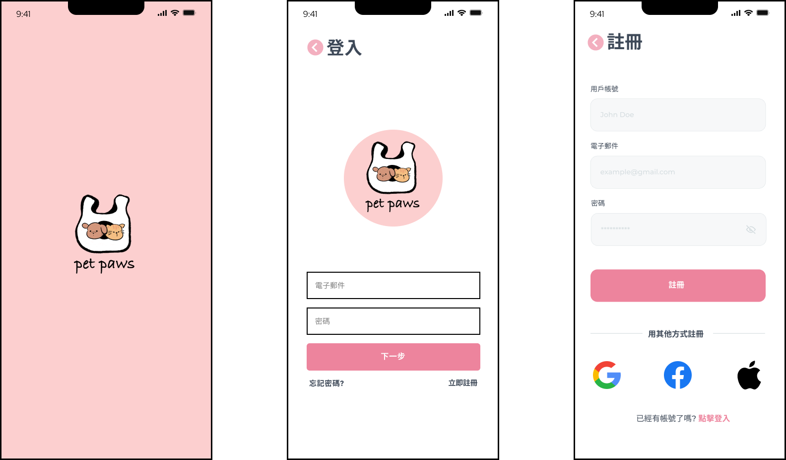

# Home page and Forum page
> The Home page is different from other communities. You can add pets on Home page, and you can also click on the post and watch the article you need.
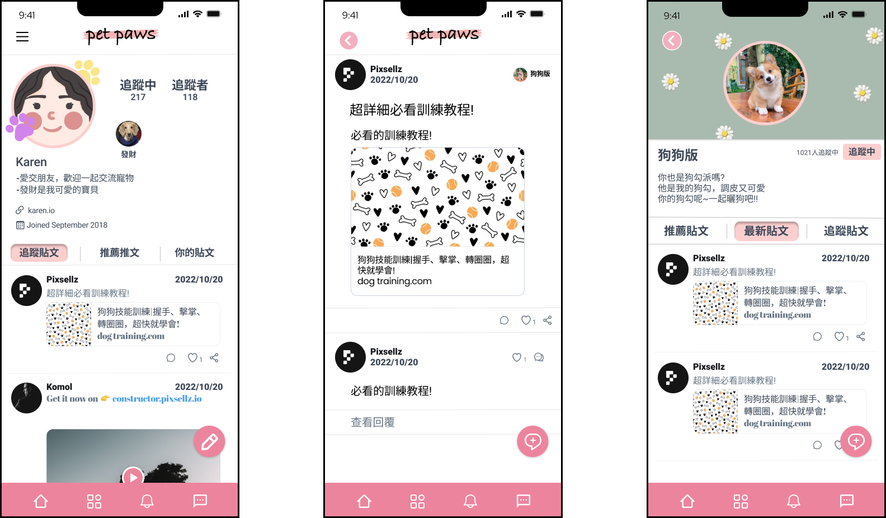

# Profile and Pet page
>You can watch all kinds of information in the Profile page, and you can add your own fur kids in PetPaws.
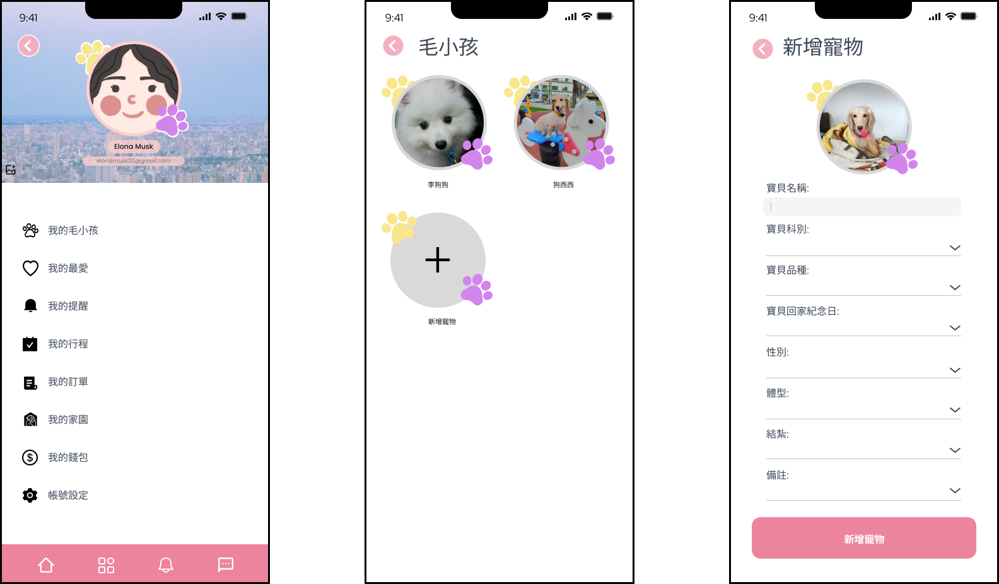

# Messenge page
>Users can communicate with people in the community or the stores provide the service in Messenge page.
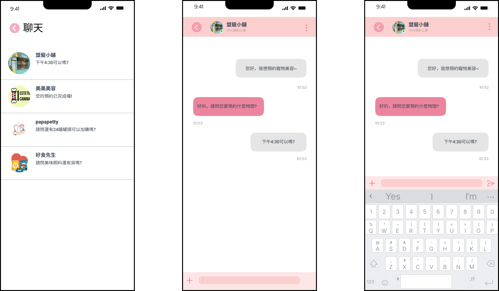

# Function and Notification page
>PetPaws has 4 additional functions, Pet Home, Diary, Reservation Service, Online Store, and has a complete notification system for users.
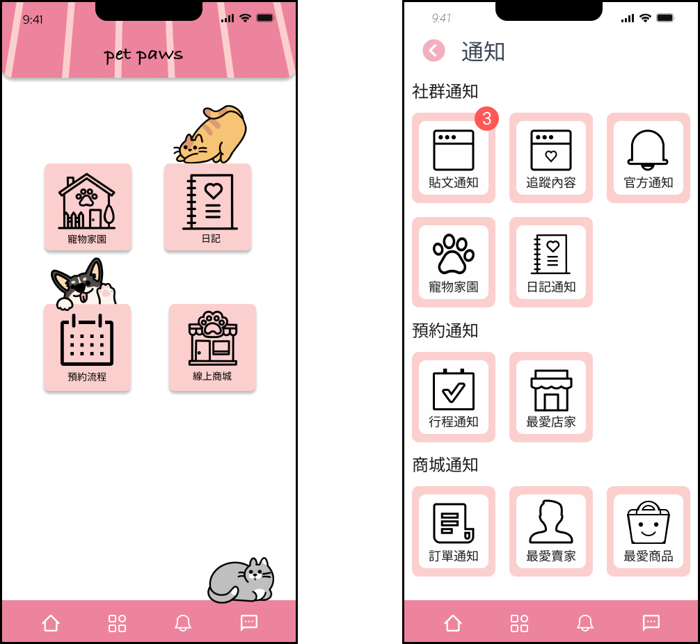

# Diary page
>You can record everything of you and your pet in the Diary page，and you could share your diary to community.
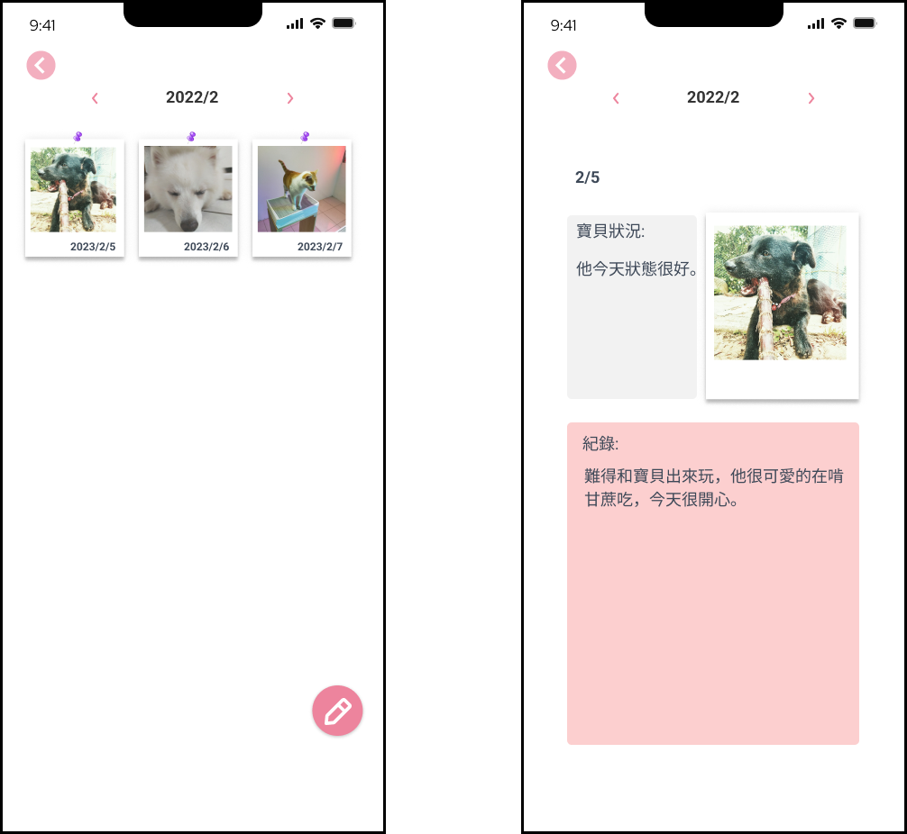

# Pet Home page
>You can create your own electronic pets on Pet Home page,and interact with your electronic pets.
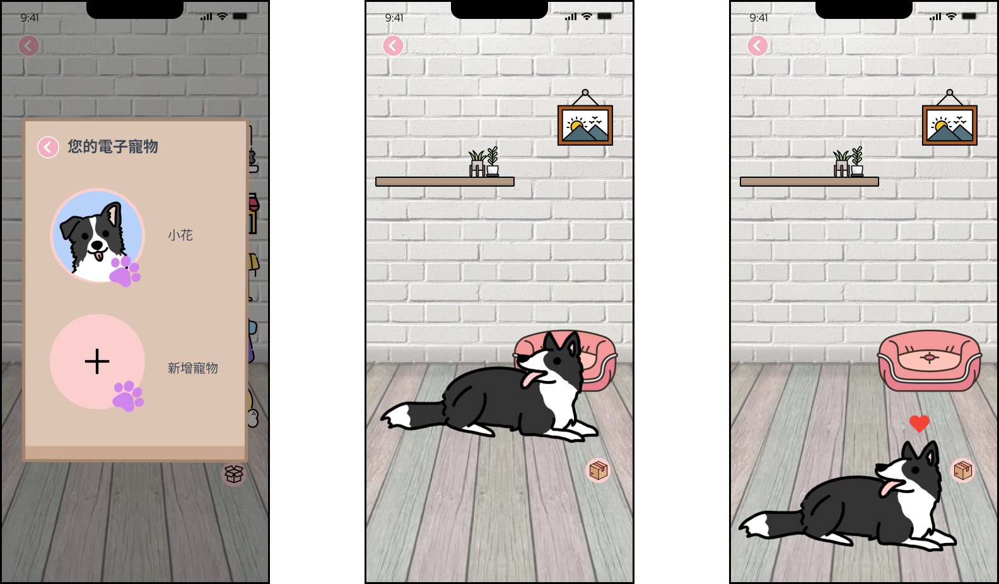
> You can buy clothes and furniture for your electronic pets in the Pet Mall.
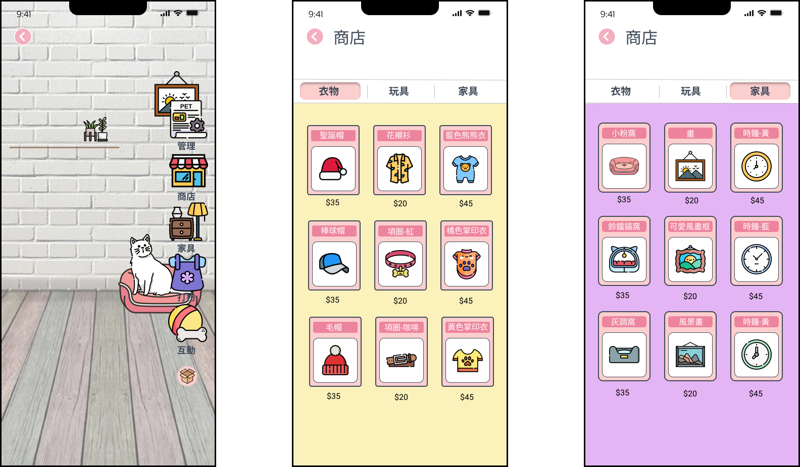

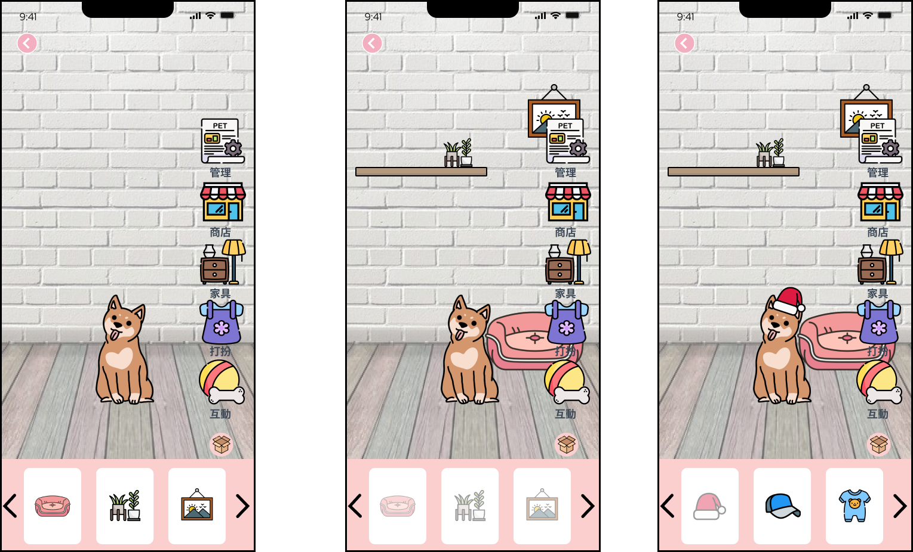

# Reservation page
>Reservation page provides pet-friendly service to help users take care of their own pets better. 
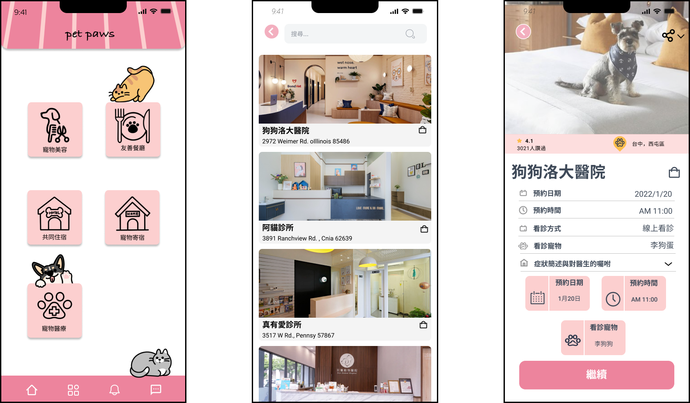

# Shopping and Shopping Cart page
> Users can buy pet supplies on Online Store,our Online Store has its own product categories and individual sellers.
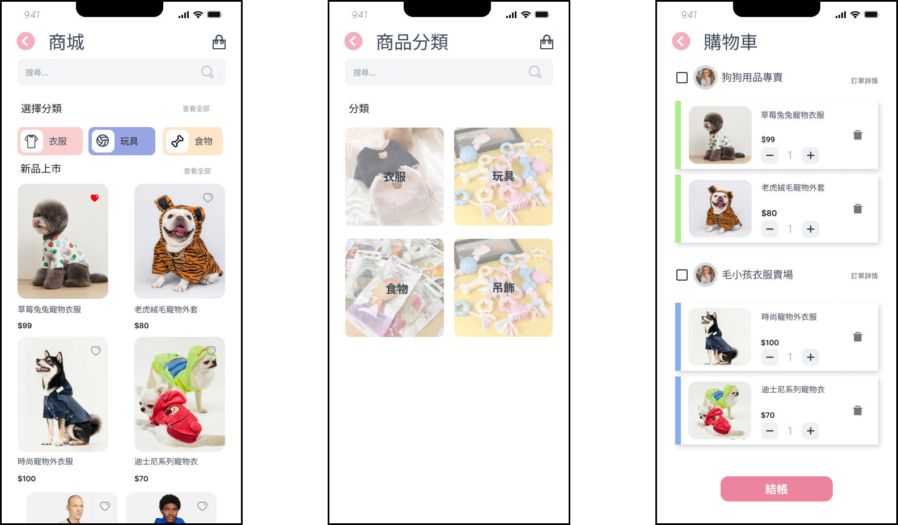

> Store and Product page

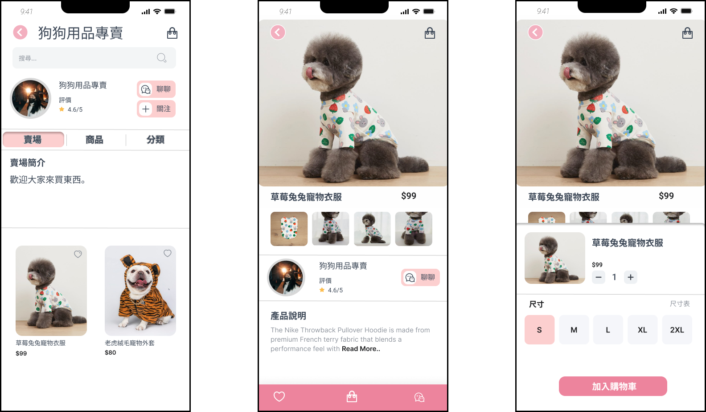

# Set up page
>You can can set the index on Set up page, basic information, notifications, privacy settings, etc.
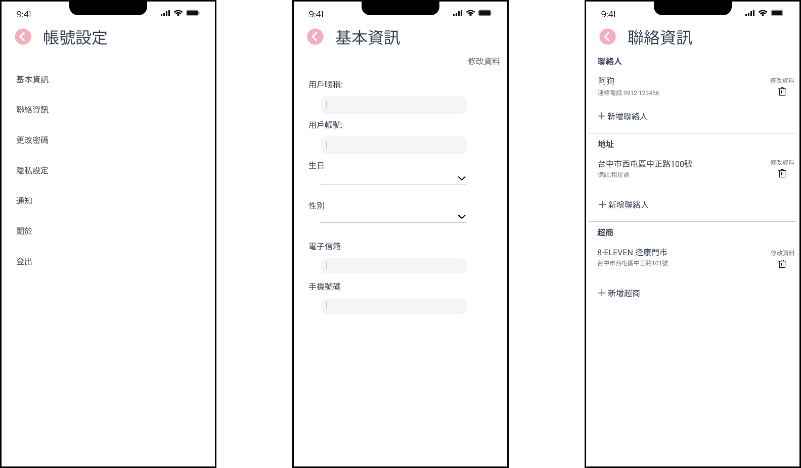

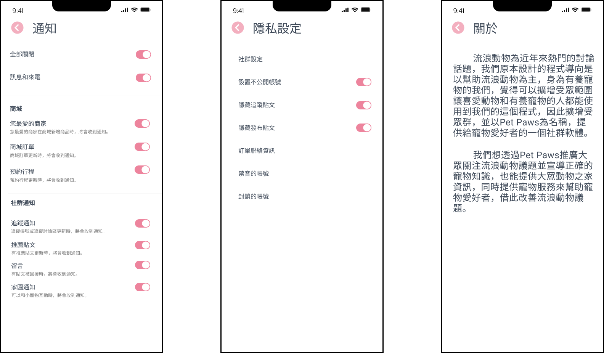
